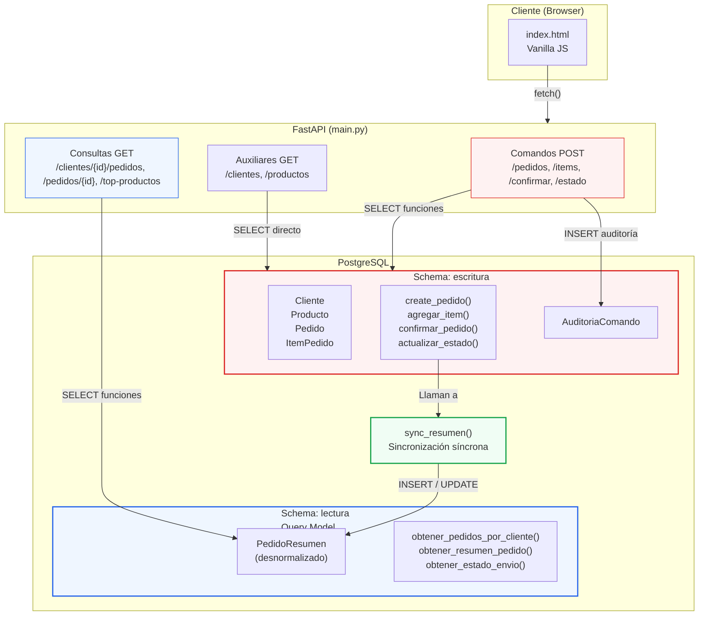

# Diagrama de Arquitectura CQRS

## Flujo

1. **Comandos** (rojo): el usuario envía un POST desde la UI → FastAPI llama a una función del schema `escritura` → valida reglas de negocio → modifica tablas normalizadas → sincroniza el modelo de lectura → registra auditoría. Todo en una misma transacción (consistencia fuerte).

2. **Consultas** (azul): el usuario hace un GET → FastAPI llama a una función del schema `lectura` → lee de `PedidoResumen` sin JOINs ni agregaciones en tiempo de lectura.

3. **Sincronización** (verde): `sync_resumen()` reconstruye la fila desnormalizada de `PedidoResumen` a partir del estado actual del modelo de escritura. Se ejecuta dentro de cada comando (síncrona).
